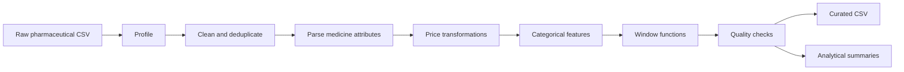

# 💊 Pharmaceutical Products Data Pipeline with PySpark & AWS Glue

## Overview

An end-to-end Data Engineering project that processes, validates, transforms, and analyzes pharmaceutical product data using PySpark and AWS Glue.

### Tech Stack

- PySpark
- AWS Glue
- AWS S3
- Spark SQL
- Window Functions
- Data Quality Framework
- Python

---

## Project Highlights

✅ Processes 254K+ pharmaceutical product records

✅ Profiles schemas, missing values, duplicates, cardinality, and numeric fields

✅ Cleans text, data types, null placeholders, and duplicate business keys

✅ Parses product strength, unit, dosage form, and combination-drug status

✅ Calculates per-unit prices and manufacturer/category comparisons

✅ Uses Spark window functions for ranking, running totals, and lag analysis

✅ Produces category, manufacturer, dosage-form, and ingredient summaries

✅ Assigns data-quality flags for missing or invalid values

✅ Supports local execution and AWS Glue deployment

---

## Architecture

```text
                    ┌──────────────────┐
                    │   Raw CSV Data   │
                    │ 254K+ Records    │
                    └────────┬─────────┘
                             │
                             ▼
                    ┌──────────────────┐
                    │ Data Profiling   │
                    └────────┬─────────┘
                             │
                             ▼
                    ┌──────────────────┐
                    │ Data Cleaning    │
                    └────────┬─────────┘
                             │
                             ▼
                    ┌──────────────────┐
                    │ Medicine Parsing │
                    └────────┬─────────┘
                             │
                             ▼
                    ┌──────────────────┐
                    │ Price Engineering│
                    └────────┬─────────┘
                             │
                             ▼
                    ┌──────────────────┐
                    │ Window Analytics │
                    └────────┬─────────┘
                             │
                             ▼
                    ┌──────────────────┐
                    │ Quality Checks   │
                    └────────┬─────────┘
                             │
           ┌─────────────────┴────────────────┐
           ▼                                  ▼
 ┌───────────────────┐            ┌───────────────────┐
 │ Curated Dataset   │            │ Analytics Reports │
 └───────────────────┘            └───────────────────┘
```

---

## Pipeline Flow



---

## Dataset Schema

| Field | Description |
|---------|-------------|
| product_id | Product identifier |
| brand_name | Marketed product name |
| manufacturer | Manufacturer name |
| price_inr | Price in Indian rupees |
| dosage_form | Tablet, capsule, syrup, injection |
| pack_size | Number or volume of units |
| primary_ingredient | Main active ingredient |
| primary_strength | Strength such as 500mg |
| num_active_ingredients | Number of active ingredients |
| therapeutic_class | Therapeutic category |

---

## Project Structure

```text
pharma-pyspark-glue/
│
├── README.md
├── requirements.txt
├── glue/
│   └── pharma_glue_job.py
├── scripts/
├── src/
│   ├── pipeline.py
│   ├── spark_session.py
│   ├── config.py
│   └── transformations/
│       ├── profiling.py
│       ├── cleaning.py
│       ├── medicine_processing.py
│       ├── price_transforms.py
│       ├── categorical.py
│       ├── window_functions.py
│       ├── quality_checks.py
│       └── aggregations.py
├── tests/
└── run_local.py
```

---

## Transformation Stages

### 1. Data Profiling

- Schema inspection
- Row count analysis
- Missing value detection
- Duplicate identification
- Distinct value analysis
- Numeric statistics

### 2. Data Cleaning

- Convert columns to snake_case
- Trim whitespace
- Normalize placeholders to null
- Cast data types
- Remove exact duplicates
- Remove business-key duplicates

### 3. Medicine Processing

- Extract medicine strength
- Normalize units
- Standardize dosage forms
- Detect combination medicines
- Clean manufacturer names

### 4. Price Engineering

- Price per unit calculation
- Price band classification
- Manufacturer average comparison
- Category average comparison
- Safe arithmetic using try_divide()

### 5. Window Analytics

- Manufacturer price ranking
- Running totals
- Contribution percentages
- Lag-based comparisons
- Category min/max calculations

### 6. Quality Framework

| Flag | Meaning |
|--------|---------|
| ok | Valid record |
| missing_product_name | Product name missing |
| invalid_price | Price invalid |
| missing_strength | Strength unavailable |
| missing_strength_unit | Unit unavailable |

---

## Sample Business Metrics

### Product Ranking

```python
Window.partitionBy("manufacturer") \
      .orderBy(F.desc("price"))
```

### Price Per Unit

```python
price_per_unit = price / package_quantity
```

### Running Totals

```python
sum(price).over(window_spec)
```

---

## Curated Output

Output File:

```text
output/curated_products.csv
```

Key Columns:

| Column | Description |
|----------|------------|
| product_id | Product Identifier |
| product_name_clean | Clean Product Name |
| manufacturer_clean | Standardized Manufacturer |
| ingredient_clean | Active Ingredient |
| strength_value | Numeric Strength |
| strength_unit | Unit |
| dosage_form | Standardized Form |
| price_per_unit | Derived Metric |
| manufacturer_product_rank | Product Rank |
| quality_flag | Validation Status |

---

## Verified Results

| Metric | Result |
|----------|----------|
| Raw Rows | 253,973 |
| Curated Rows | 253,713 |
| Distinct Manufacturers | 7,648 |
| Valid Records | 251,495 |
| Missing Strength | 2,183 |
| Invalid Price | 35 |

---

## AWS Glue Deployment

### Input

```text
s3://your-bucket/raw/products.csv
```

### Processing

```text
AWS Glue Job
↓
PySpark Transformations
↓
Data Quality Validation
```

### Output

```text
s3://your-bucket/curated/pharma-products/
```

---

## Running Locally

### Install Dependencies

```bash
pip install -r requirements.txt
```

### Quick Test Run

```bash
python run_local.py --sample 0.01
```

### Full Dataset

```bash
python run_local.py
```

---

## Future Improvements

- Parquet Output Support
- Delta Lake Integration
- Glue Catalog Registration
- Athena Query Layer
- QuickSight Dashboards
- PyTest Coverage
- GitHub Actions CI/CD
- Terraform Infrastructure Deployment

---

## Data Engineering Concepts Demonstrated

### PySpark

- DataFrames
- Transformations
- Aggregations
- Window Functions
- Spark SQL
- Null Handling
- ANSI Mode

### AWS

- AWS Glue
- Amazon S3
- Distributed ETL
- Cloud Data Processing

### Data Quality

- Validation Rules
- Deduplication
- Standardization
- Business Rule Enforcement

---

## Author

Built as a hands-on Data Engineering project using PySpark and AWS Glue to demonstrate production-style ETL design, data quality management, and scalable analytical processing.
